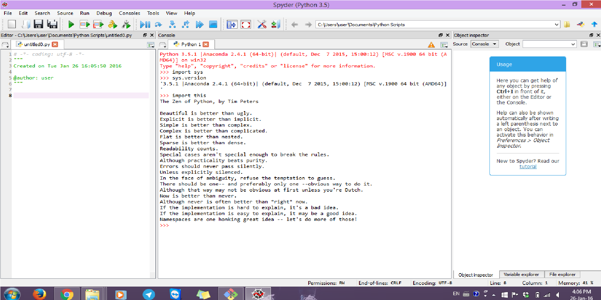

UECM3033 Assignment #1 Report
========================================================

- Prepared by: ** Loo Li Ping**
- Tutorial Group: T2

--------------------------------------------------------

## Task 1 -- setup a github repository

The reports, codes and supporting documents are uploaded to Github at: 

[https://github.com/graceloo94/UECM3033_assign1](https://github.com/graceloo94/UECM3033_assign1)

---------------------------------------------------------

## Task 2 -- setup python

Put here the screen shot of file (python.png)

------------------------------------------------------------

## Task 3 -- modify and run Python script

In this section, please report:

1. The hexadecimal value of your student ID.

Hexadecimal representation of 1205887 is 0x12667f

2. Write down the definite integrals that you have chosen.

$$\int_0^{1} {(ln{x})^2}dx = {2}.$$

3. Write down your system of 10 linear equations.
\begin{align}  x_1+x_2+x_3+2x_4+x_5+2x_6+3x_7+x_8+2x_9+x_{10} &= 176. \\
3x_1+4x_2+2x_3+5x_4+2x_5+2x_6+3x_7+2x_8+3x_9+2x_{10} &= 286.\\
5x_1+6x_2+3x_3+8x_4+2x_5+2x_6+5x_7+5x_8+4x_9+4x_{10} &= 462. \\
7x_1+8x_2+4x_3+11x_4+3x_5+2x_6+6x_7+x_8+5x_9+5x_{10} &= 502. \\
9x_1+10x_2+5x_3+14x_4+4x_5+3x_6+8x_7+2x_8+8x_9+3x_{10} &= 624. \\
11x_1+12x_2+6x_3+15x_4+5x_5+3x_6+7x_7+5x_8+2x_9+4x_{10}&= 606. \\
13x_1+14x_2+7x_3+14x_4+5x_5+3x_6+2x_7+3x_8+x_9+2x_{10} &= 456. \\
15x_1+16x_2+8x_3+11x_4+x_5+5x_6+x_7+4x_8+3x_9+x_{10} &= 452. \\
17x_1+18x_2+9x_3+10x_4+x_5+5x_6+x_7+2x_8+5x_9+2x_{10} &= 486. \\
19x_1+20x_2+10x_3+8x_4+x_5+5x_6+3x_7+x_8+6x_9+2x_{10} &= 518. \end{align}

-----------------------------------

last modified: 28 Jan 2016, 3.45pm 
